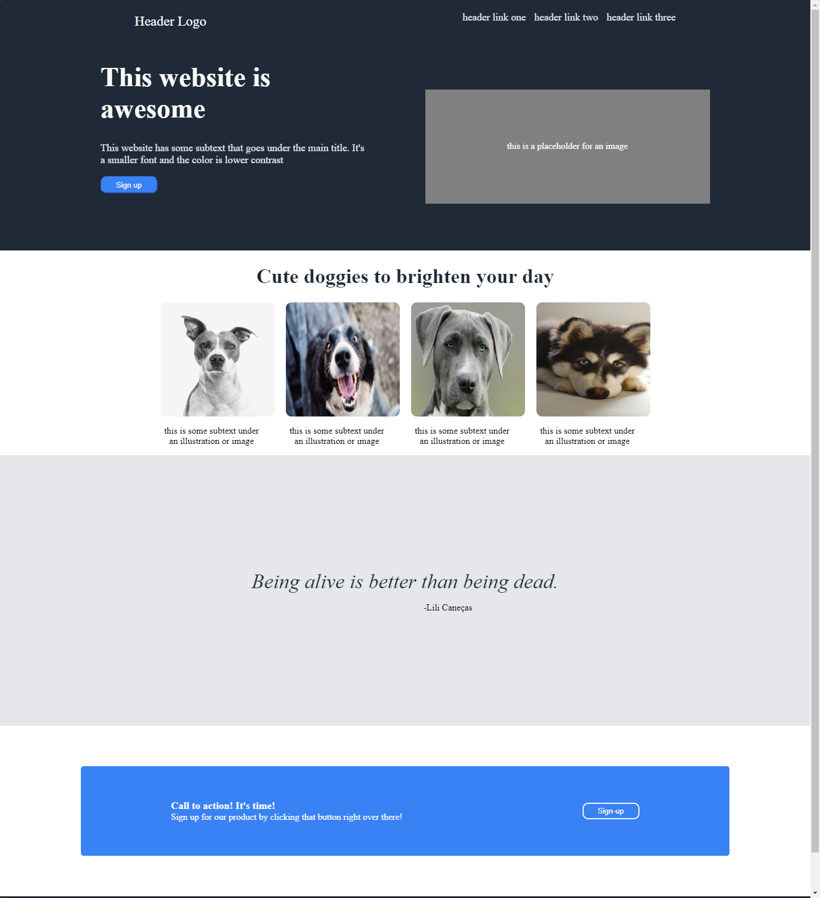

# Landing Page Project

This project is part of The Odin Project's curriculum. It's a simple landing page that demonstrates basic HTML and CSS skills.

## Project Overview

The landing page includes several sections such as a header with navigation links, a hero section, a section with images and subtext, a quote section, and a call-to-action section with a sign-up button.

## Contribution

Contributions, issues, and feature requests are welcome! You can also contribute by submitting pull requests.
